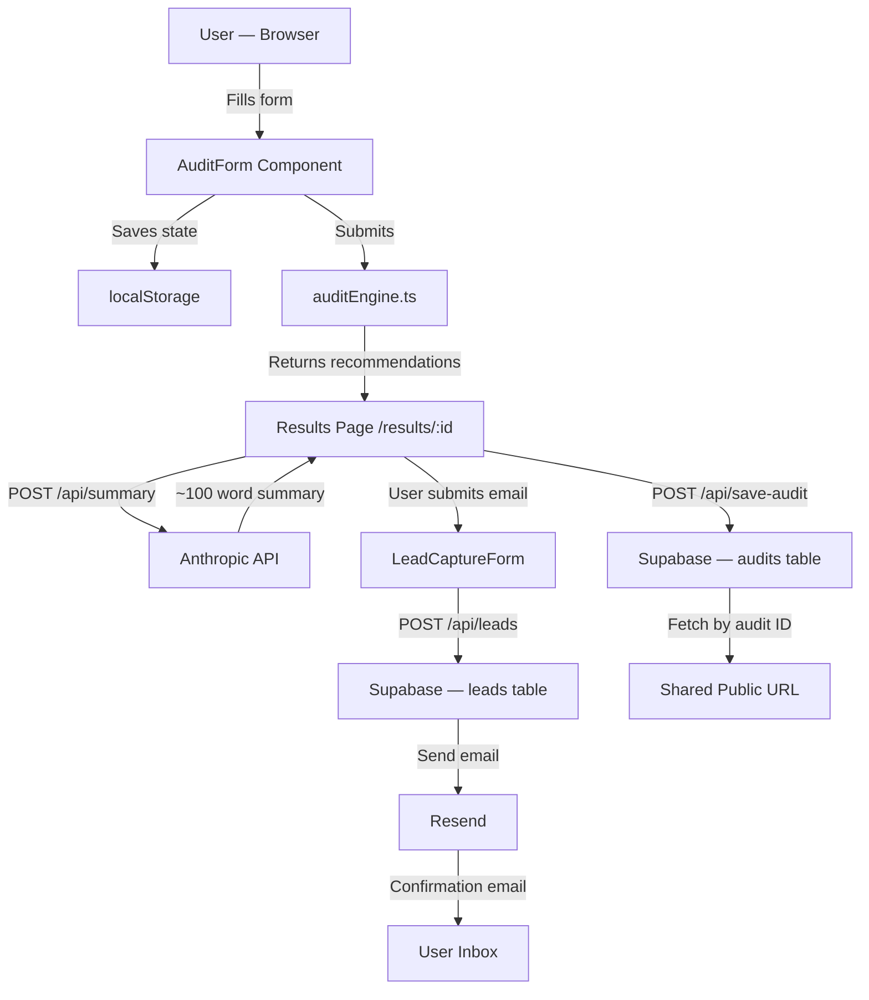

# Architecture

## System Diagram

## Data Flow

1. User fills the form — tool, plan, spend, seats, team size, use case
2. On submit, `auditEngine.ts` runs deterministic rules against the input — no API call
3. Results + a UUID are saved to localStorage
4. User is redirected to `/results/:id`
5. Results page reads from localStorage (own audit) or Supabase (shared URL)
6. Anthropic API generates a ~100-word summary — falls back to a template if it fails
7. User optionally submits email — stored in Supabase, confirmation sent via Resend

## Why This Stack

**Next.js 14 (App Router):** API routes and React server components in one project. No separate backend needed. Vercel deployment is one command.

**TypeScript:** Catches type errors at compile time. Audit engine logic has many edge cases — types make it debuggable.

**Tailwind CSS:** Utility-first CSS keeps component styles co-located. No context switching between CSS files.

**Supabase:** Postgres-compatible REST API, no SDK required, generous free tier. Stores both audit results (for shareable URLs) and leads.

**Resend:** Simple REST API for transactional email, free tier sufficient for MVP.

**Anthropic API (claude-haiku):** Fast, cheap, good enough for a 100-word summary. Haiku over Sonnet because latency matters on the results page.

## What I'd Change at 10k Audits/Day

1. **Redis for rate limiting** — in-memory Map resets on every cold start. Upstash Redis would persist across instances.
2. **Queue for email sending** — Resend calls are synchronous right now. At scale, move to a background job queue (Inngest or Trigger.dev) so email failures don't block the API response.
3. **CDN for audit results** — Cache shareable audit pages at the edge (Vercel Edge Config or Cloudflare KV) so Supabase isn't hit on every share link open.
4. **Audit result TTL** — Add expiry to audit records (e.g., 90 days) to keep the DB lean.
5. **Separate read/write DB** — Supabase read replicas for the public shareable URL fetches.
